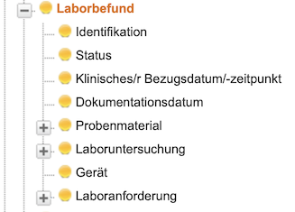
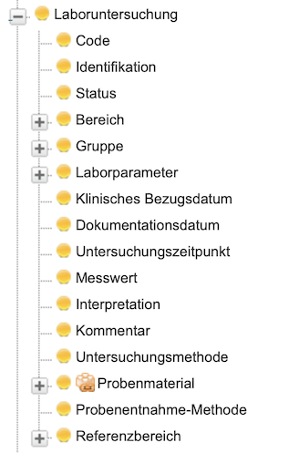
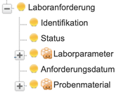
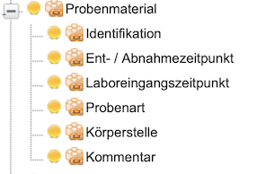

# Guidance - MII IG Laborbefund v2027.0.0

* [**Table of Contents**](toc.md)
* **Guidance**

## Guidance

# Laboratory Module Description

Laboratory tests play a decisive role in most medical diagnoses. Preliminary results can already be relevant in time-critical applications, such as clinical decision support warning about a low haemoglobin value. Final laboratory results are normally used in both patient care and research. The central document and subject of this module is the laboratory report produced by a medical laboratory.

Laboratory reports group tests performed by a medical laboratory. They record whether a report is preliminary or final and several clinically relevant timestamps. A tabular mapping is available on [Laboratory timestamps](laboratory-timestamps.md).

## Clinical reference time

For every test there is a time at which the measured property in the specimen most likely represented the corresponding property in the patient. This is usually the collection time. If a sufficiently precise collection time is unavailable, the laboratory receipt time or another estimated time may be used. This clinical reference time supports chronological comparison of repeated measurements and is not the time at which the analyser performed the measurement.

The clinical reference time of the individual test and of the laboratory report is usually identical. If tests in one report have different collection or receipt times, each test can retain its own reference time and the report can use an appropriate representative time, for example the earliest one. The value is represented both on Observation and DiagnosticReport to facilitate analysis, even though this introduces redundancy.

## Other relevant timestamps

* **Collection time:** when the specimen was obtained. It is represented on the specimen and may also serve as the clinical reference time. A collection period can be used for specimens collected over an interval.
* **Laboratory receipt time:** when the specimen arrived at the laboratory. It is often captured automatically and may be more reliable than a manually documented collection time.
* **Request time:** when the request was sent, or when the request arrived if the former is unavailable. It is represented by ServiceRequest.
* **Observation documentation time:** when the result became available to clinical staff, typically after verification by laboratory staff.
* **Report documentation time:** when the report was verified, released or issued. A preliminary report can be represented separately with the appropriate status.

The ambiguous term “order time” is deliberately not used because it may mean either the request time or a timestamp associated with the report.

## Interpretations and comments

Medical interpretations and comments are an essential part of a laboratory report. The main interpretation is usually recorded as free text; additional structured codes may be used where suitable terminology and licences are available. Comments concerning only one measurement, such as “measurement interfered with”, should be stored as a note. A coded interpretation relative to the reference interval is possible but redundant when the reference interval itself is represented explicitly.

## Specimens

Comments about specimen quality may be represented with the Biobank module's Specimen profile. Alternatively they can remain as additional information on the affected measurement when this matches the source system's granularity.

